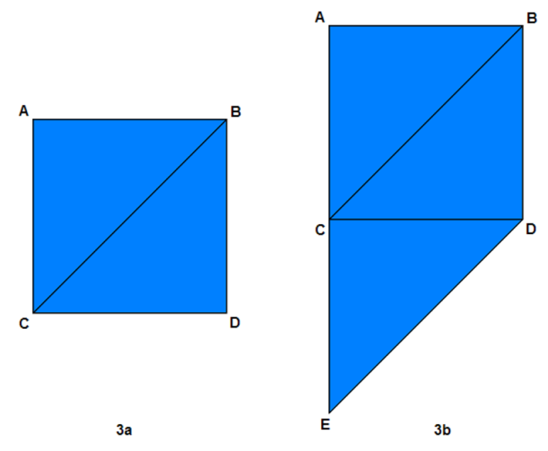

{: .align-center}

DirectX3D 11에서는 정점 정보가 Buffer Resource에 저장된다. 정점 정보를 저장하는 데 사용되는 Buffer를 Vertex Buffer라고 한다.

```c++
Vertex vertices[] =
{
	// 8개의 꼭짓점을 가진 큐브
	// 한 점이 접한 면은 3개이고, 각각 Normal 벡터가 존재한다.
	{ Vector3(-1.0f, 1.0f,-1.0f), Vector2(1.0f, 0.0f),Vector3(0.0f, 1.0f, 0.0f) },		// 윗면이라 y전부 +1
	{ Vector3(1.0f, 1.0f,-1.0f), Vector2(0.0f, 0.0f),Vector3(0.0f, 1.0f, 0.0f) },
	{ Vector3(1.0f, 1.0f, 1.0f), Vector2(0.0f, 1.0f),Vector3(0.0f, 1.0f, 0.0f) },
	{ Vector3(-1.0f, 1.0f, 1.0f), Vector2(1.0f, 1.0f),Vector3(0.0f, 1.0f, 0.0f) },

	{ Vector3(-1.0f,-1.0f,-1.0f), Vector2(0.0f, 0.0f),Vector3(0.0f,-1.0f, 0.0f) },		// 아랫면이라 y전부 -1
	{ Vector3(1.0f,-1.0f,-1.0f), Vector2(1.0f, 0.0f),Vector3(0.0f,-1.0f, 0.0f) },
	{ Vector3(1.0f,-1.0f, 1.0f), Vector2(1.0f, 1.0f),Vector3(0.0f,-1.0f, 0.0f) },
	{ Vector3(-1.0f,-1.0f, 1.0f), Vector2(0.0f, 1.0f),Vector3(0.0f,-1.0f, 0.0f) },

	{ Vector3(-1.0f,-1.0f, 1.0f), Vector2(0.0f, 1.0f),Vector3(-1.0f, 0.0f, 0.0f) },		// 왼쪽면 이라 x전부 -1
	{ Vector3(-1.0f,-1.0f,-1.0f), Vector2(1.0f, 1.0f),Vector3(-1.0f, 0.0f, 0.0f) },
	{ Vector3(-1.0f, 1.0f,-1.0f), Vector2(1.0f, 0.0f),Vector3(-1.0f, 0.0f, 0.0f) },
	{ Vector3(-1.0f, 1.0f, 1.0f), Vector2(0.0f, 0.0f),Vector3(-1.0f, 0.0f, 0.0f) },

	{ Vector3(1.0f,-1.0f, 1.0f), Vector2(1.0f, 1.0f),Vector3(1.0f, 0.0f, 0.0f) },		// 오른쪽면 이라 x전부 +1
	{ Vector3(1.0f,-1.0f,-1.0f), Vector2(0.0f, 1.0f),Vector3(1.0f, 0.0f, 0.0f) },
	{ Vector3(1.0f, 1.0f,-1.0f), Vector2(0.0f, 0.0f),Vector3(1.0f, 0.0f, 0.0f) },
	{ Vector3(1.0f, 1.0f, 1.0f), Vector2(1.0f, 0.0f),Vector3(1.0f, 0.0f, 0.0f) },

	{ Vector3(-1.0f,-1.0f,-1.0f), Vector2(0.0f, 1.0f),Vector3(0.0f, 0.0f,-1.0f) },		// 앞면이라 z전부 -1
	{ Vector3(1.0f,-1.0f,-1.0f), Vector2(1.0f, 1.0f),Vector3(0.0f, 0.0f,-1.0f) },
	{ Vector3(1.0f, 1.0f,-1.0f), Vector2(1.0f, 0.0f),Vector3(0.0f, 0.0f,-1.0f) },
	{ Vector3(-1.0f, 1.0f,-1.0f), Vector2(0.0f, 0.0f),Vector3(0.0f, 0.0f,-1.0f) },

	{ Vector3(-1.0f,-1.0f, 1.0f), Vector2(1.0f, 1.0f),Vector3(0.0f, 0.0f, 1.0f) },		//뒷면이라 z전부 +1
	{ Vector3(1.0f,-1.0f, 1.0f), Vector2(0.0f, 1.0f),Vector3(0.0f, 0.0f, 1.0f) },
	{ Vector3(1.0f, 1.0f, 1.0f), Vector2(0.0f, 0.0f),Vector3(0.0f, 0.0f, 1.0f) },
	{ Vector3(-1.0f, 1.0f, 1.0f), Vector2(1.0f, 0.0f),Vector3(0.0f, 0.0f, 1.0f) },
	};
```

위 코드처럼 정점 정보에는 Position, Normal Vector, Color, Texture Position 등과 같이 다양한 속성을 가지고 있다. Vertex Layout은 각 속성이 사용하는 데이터 유형, 각 속성의 크기, 메모리 내 속성의 순서 등 이러한 '속성이 메모리에 위치하는 방식'을 정의한다.

```c++
struct SimpleVertex
{
	DirectX::XMFLOAT3 Pos;
};
```

이 튜토리얼에서는 정점의 '위치'로만 작업한다. 따라서 Vertex를 XMFLOAT3 유형의 단일 필드로 Struct 구조체에 정의한다.

```c++
    // Define Triangle vertices
	const SimpleVertex vertices[] =
	{
		DirectX::XMFLOAT3(0.0f, 0.5f, 0.5f),
		DirectX::XMFLOAT3(0.5f, -0.5f, 0.5f),
		DirectX::XMFLOAT3(-0.5f, -0.5f, 0.5f),
	};
```

이제 정점을 나타내는 구조체가 생겼다. 이는 시스템 메모리에 정점 정보를 저장하는 역할을 한다. 하지만 정점 정보만 들어있는 Vertex Buffer를 GPU에 전달하는 것은 메모리 덩어리를 전달하는 것에 불과하다. Buffer에서 Vertex의 올바른 속성을 추출하려면 GPU가 Vertex의 Layout 대해서도 알고 있어야 한다.

```c++
	/// Define the input layout
	D3D11_INPUT_ELEMENT_DESC layout[] =
	{
		{ "POSITION", 0, DXGI_FORMAT_R32G32B32_FLOAT, 0, 0, D3D11_INPUT_PER_VERTEX_DATA, 0 },
	};
	constexpr UINT numElements = ARRAYSIZE(layout);

	/// Create the input layout
	hr = g_pDevice->CreateInputLayout(layout, numElements, vbBlob->GetBufferPointer(),
		vbBlob->GetBufferSize(), &g_pVertexLayout);

	vbBlob->Release();

	if (FAILED(hr))
		return FALSE;

	// Set the input layout
	g_pDeviceContext->IASetInputLayout(g_pVertexLayout);
```

DirectX3D 11에서 Input Layout은 GPU가 이해할 수 있는 방식으로 Vertex의 구조를 설명한다. 각 Vertex의 속성은 D3D11_INPUT_ELEMENT_DESC 구조체로 설명할 수 있다. D3D11_INPUT_ELEMENT_DESC를 하나 이상의 배열로 정의한 다음, 해당 배열을 사용하여 Vertex 전체를 설명하는 Input Layout 객체를 생성한다.

### Vertex Layout & Vertex Shader
---

```c++
	float4 main(float4 pos : POSITION) : SV_POSITION
	{
		return pos;
	}
```


```c++
	/// Define the input layout
	D3D11_INPUT_ELEMENT_DESC layout[] =
	{
		{ "POSITION", 0, DXGI_FORMAT_R32G32B32_FLOAT, 0, 0, D3D11_INPUT_PER_VERTEX_DATA, 0 },
	};
```

Vertex Shader는 Vertex Layout과 긴밀하게 결합되어 있는데, 그 이유는 Vertex Layout 오브젝트를 생성하려면 Vertex Shader의 Input Signature 가 필요하기 때문이다. 위 코드에서 'POSITION'이 Input Signature이다.

```c++
	// 컴파일된 .HLSL 파일을 저장하는 데 사용되는 인터페이스
	// Binary Large Object
	ID3DBlob* pErrorBlob = nullptr;

	hr = D3DCompileFromFile(szFileName, nullptr, nullptr, szEntryPoint, szShaderModel,
		dwShaderFlags, NULL, ppBlobOutput, &pErrorBlob);
```

D3DCompileFromFile()에서 도출된 ID3DBlob 객체를 사용하여 Vertex Shader의 Input Signature를 나타내는 Blob을 확보한다. 

> Blob(Binary Large Object)는 HSLS 파일을 이진 데이터로 저장한다.

```c++
	/// Create the input layout
	hr = g_pDevice->CreateInputLayout(layout, numElements, vbBlob->GetBufferPointer(),
		vbBlob->GetBufferSize(), &g_pVertexLayout);

	vbBlob->Release();

	if (FAILED(hr))
		return FALSE;

	// Set the input layout
	g_pDeviceContext->IASetInputLayout(g_pVertexLayout);
```

이후 ID3D11Device::CreateInputLayout()을 호출하여 Vertex Layout 객체를 생성하고, ID3D11DeviceContext::IASetInputLayout()을 호출하여 Vertex Layout을 파이프라인에 설정할 수 있다.

```c++
	/// Create the vertex buffer with Desc & Data
	D3D11_BUFFER_DESC vbDesc;
	ZeroMemory(&vbDesc, sizeof(vbDesc));

	vbDesc.Usage = D3D11_USAGE_DEFAULT;
	vbDesc.ByteWidth = sizeof(SimpleVertex) * 3;
	vbDesc.BindFlags = D3D11_BIND_VERTEX_BUFFER;
	vbDesc.CPUAccessFlags = 0;

	D3D11_SUBRESOURCE_DATA vbData;
	ZeroMemory(&vbData, sizeof(vbData));

	vbData.pSysMem = vertices;

	hr = g_pDevice->CreateBuffer(&vbDesc, &vbData, &g_pVertexBuffer);
	if (FAILED(hr))
		return hr;

	/// Set vertex buffer
	constexpr UINT stride = sizeof(SimpleVertex);
	constexpr UINT offset = 0;
	g_pDeviceContext->IASetVertexBuffers(0, 1, &g_pVertexBuffer, &stride, &offset);
```

DirectX3D 11에서 Vertex Buffer를 생성하려면 두 개의 구조체, D3D11_BUFFER_DESC와 D3D11_SUBRESOURCE_DATA를 채운 다음 ID3D11Device::CreateBuffer()를 호출해, Vertex Buffer를 생성할 수 있다.

* D3D11_BUFFER_DESC : Vertex Buffer 객체에 대한 서술 구조체
* D3D11_SUBRESOURCE_DATA : Vertex Buffer에 "복사"할 실제 데이터(정점 데이터)에 대한 서술 구조체

버텍스 버퍼가 생성되면 ID3D11DeviceContext::IASetVertexBuffers()를 호출하여 Device에 바인딩한다.

=> 정리하자면 정점 데이터를 SimpleVertex 구조체를 통해 정의하고, Vertex Layout를 생성해 Vertex의 속성 구조를 설명한다. 이후 정점 데이터를 Vertex Buffer에 복사한다.

---

{: .align-center}

하나의 삼각형을 렌더링하기 위해서는 3개의 정점을 GPU로 전송해야 한다. 따라서 Vertex Buffer에는 3개의 Vertex가 있다. 두 개의 삼각형을 렌더링하려면 어떻게 해야 할까? 한 가지 방법은 GPU에 6개의 정점을 보내는 것이다. 처음 세 개의 정점은 첫 번째 삼각형을 정의하고 두 번째 세 개의 정점은 두 번째 삼각형을 정의한다. 이 Topology를 Triangle List라고 한다. Triangle List는 이해하기 쉽다는 장점이 있지만, 매우 비효율적이다. 연속적으로 렌더링된 삼각형이 정점을 공유할 때 이러한 경우가 발생한다. 예를 들어 그림 3a는 두 개의 삼각형으로 구성된 정사각형을 보여준다 (일반적으로 삼각형은 정점을 시계 방향으로 나열하여 정의). Triangle List를 사용하여 이 두 삼각형을 GPU에 전송하면 vertex Buffer는 다음과 같은 상태가 된다.

A B C C B D{: .text-center}

B와 C 정점은 Vertex Buffer에 두 번 들어가게 된다. 왜냐하면 두 삼각형은 맞붙어있고, 두 정점을 공유하고 있기 때문이다.

이 문제를 개선하기 위해, 두 번째 삼각형을 렌더링할 때 Vertex Buffer에서 세 개의 정점을 모두 가져오는 대신 이전 삼각형의 정점 중 2개를 사용하고 Vertex Buffer에서 새로운 정점 1개만 가져온다고 GPU에 알려주면 Vertex Buffer를 더 작게 만들 수 있다. 이 기능은 DirectX3D에서 지원되며 이 Topology를 Triangle Strip이라고 한다.

Triangle Strip을 렌더링할 때 첫 번째 삼각형은 Vertex Buffer의 처음 세 개의 버텍스로 정의되고, 다음 삼각형은 이전 삼각형의 마지막 두 버텍스와 버텍스 버퍼의 다음 버텍스로 정의된다. 그림 3a의 사각형을 예로 들어 Triangle Strip을 사용하면 Vertex Buffer는 다음과 같다.

A B C D{: .text-center}

이렇게 Triangle Strip Topology를 사용하면 Vertex Buffer 크기가 6개의 버텍스에서 4개의 버텍스로 줄어든다. 마찬가지로 그림 3b를 Triangle Strip을 사용해서 VB에 넣어보자.

Triangle List : A B C C B D D E C{: .text-center}

Triangle Strip : A B C D E{: .text-center}

Triangle Strip을 사용할 때 Vertex Buffer의 정점이 삼각형을 그릴때 순서가 시계 방향 순서를 형성하지 않는 경우가 있다. 이 경우 자연스러운 현상이며, 이를 극복하기 위해 GPU는 이전 삼각형에서 오는 두 정점의 순서를 자동으로 바꾼다. 이 작업은 두 번째 삼각형, 네 번째 삼각형, 여섯 번째 삼각형, 여덟 번째 삼각형 .. 등의 경우에만 수행된다. 이렇게 하면 모든 삼각형의 꼭짓점 감기 순서가 시계 방향이 된다.

```c++
/// Set primitive topology
g_pDeviceContext->IASetPrimitiveTopology(D3D11_PRIMITIVE_TOPOLOGY_TRIANGLELIST);
```

Primitive Topology는 GPU가 삼각형을 렌더링하는 데 필요한 세 개의 정점을 얻는 방법을 말한다. 모든 렌더링되는 오브젝트는 삼각형의 집합으로 이루어지며 세 개의 정점이 모여 삼각형을 이룬다.

위 코드는 Triangle List를 사용해 중복되는 꼭짓점이 VB에 들어있는 상태로 작업을 할 것이라는 설정이다.

​```c++
void Render()
{
	// Clear the back buffer
	constexpr FLOAT ClearColor[4] = { 0.5f, 0.1f, 0.25f, 0.5f };
	g_pDeviceContext->ClearRenderTargetView(g_pRenderTargetView, ClearColor);

	// Render a triangle
	g_pDeviceContext->VSSetShader(g_pVertexShader, nullptr, 0);
	g_pDeviceContext->PSSetShader(g_pPixelShader, nullptr, 0);
	g_pDeviceContext->Draw(3, 0);

	// Present the information rendered to the back buffer to the front buffer (the screen)
	g_pSwapChain->Present(0, 0);
}
```

삼각형의 실제 렌더링을 수행하는 코드이며, 렌더링을 위해 Vertex Shader와 Pixel Shader를 만들었다. Vertex Shader는 삼각형 각각의 정점을 올바른 위치로 변환하는 역할을 하고, Pixel Shader는 삼각형의 각 픽셀에 대한 최종 출력 색상을 계산한다 (사실 완전한 최종은 아니다 Output Merger Stage가 있기 때문).

ID3D11DeviceContext::VSSetShader() 와 ID3D11DeviceContext::PSSetShader()를 호출 해 셰이더를 사용한다. 마지막으로 ID3D11DeviceContext::Draw()를 호출하여 현재 Vertex Buffer, Vertex Layout 및 Primitive Topology를 사용하여 삼각형을 렌더링하도록 GPU에 명령한다. Draw()의 첫 번째 파라미터는 GPU에 전송할 버텍스 수이고, 두 번째 파라미터는 전송을 시작할 첫 번째 버텍스의 인덱스이다. 하나의 삼각형을 렌더링하고 Vertex Buffer의 시작부터 렌더링하기 때문에 두 매개변수에 각각 3과 0을 사용한다.